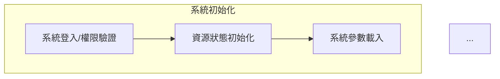

# 系統架構

## 整體架構圖

```mermaid
flowchart TD
    subgraph 系統初始化
        A1[系統登入/權限驗證]
        A2[資源狀態初始化]
        A3[系統參數載入]
        A1 --> A2 --> A3
    end
    ...
```
## 技術堆疊
- 前端技術
- 後端技術
- 資料庫
- 快取系統
- 訊息佇列

## 系統元件
1. Web 應用程式
2. 排程引擎
3. 資源管理系統
4. 通知系統
5. 報表引擎