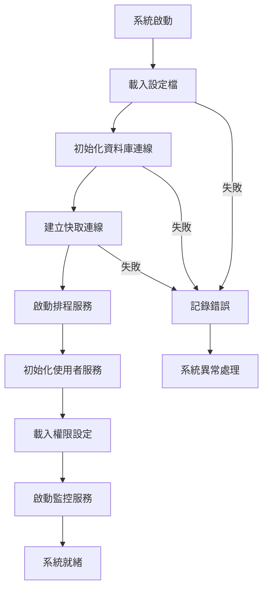

2. **docs/03-modules/01-initialization.md**
```markdown
# 系統初始化模組

## 功能概述
系統初始化模組負責系統啟動時的所有準備工作，確保系統各項功能可以正常運作。

## 核心功能
### 1. 使用者認證與權限管理
- 登入系統
  * 多重認證機制
  * Session 管理
  * 權限矩陣設定
- 權限驗證
  * 角色基礎存取控制（RBAC）
  * 功能權限管理
  * 資料存取權限

### 2. 系統參數配置
- 環境設定
  * 系統參數載入
  * 環境變數處理
  * 設定檔管理
- 系統常數設定
  * 業務規則參數
  * 系統限制設定
  * 預設值配置

### 3. 資源狀態初始化
- 資料庫連線管理
  * 連線池設定
  * 故障轉移機制
  * 效能監控
- 快取系統初始化
  * Redis 配置
  * 快取策略設定
- 外部服務連線檢查
  * API 服務檢測
  * 超時設定
  * 重試機制

## 流程圖

