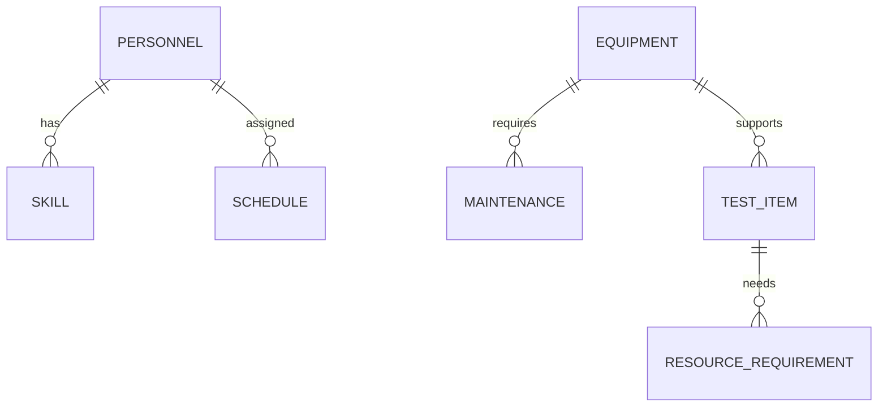

# 資源管理模組

## 功能概述
資源管理模組負責管理系統中所有可用資源，包括人力資源、設備資源及其配置。

## 核心功能
### 1. 人員資源管理
- 人員基本資料
  * 個人資訊維護
  * 專業技能管理
  * 權限等級設定
- 工時管理
  * 排班規劃
  * 休假管理
  * 加班管理
- 專業能力矩陣
  * 技能評估
  * 認證管理
  * 培訓記錄

### 2. 設備資源管理
- 設備基本資料
  * 設備清單維護
  * 規格資訊
  * 使用說明文件
- 設備狀態追蹤
  * 即時狀態監控
  * 使用紀錄
  * 效能追蹤
- 維護管理
  * 定期維護排程
  * 校正管理
  * 故障維修追蹤

### 3. 測試項目管理
- 測試項目資料庫
  * 項目分類
  * 標準作業程序
  * 所需資源清單
- 時間估算
  * 標準工時設定
  * 歷史數據分析
  * 動態調整機制

## 資料模型

## 介面設計
1. 使用者介面
- 資源總覽儀表板
- 資源配置介面
- 狀態監控畫面
2. API 介面
- 資源查詢 API
- 資源配置 API
- 狀態更新 API

## 效能最佳化
1. 資料快取策略
2. 查詢效能優化
3. 並行處理機制