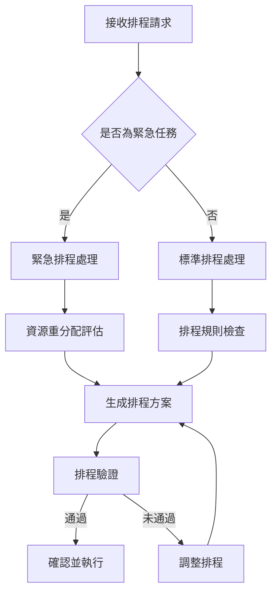

# 排程處理模組

## 功能概述
排程處理模組負責智慧化分配測試資源，確保測試任務的最佳執行順序與效率。

## 核心功能
### 1. 排程策略管理
- 標準排程
  * 優先級設定
  * 資源配置規則
  * 時間區間規劃
- 緊急排程
  * 即時插單處理
  * 資源重分配
  * 影響評估

### 2. 智慧排程演算法
- 基本排程邏輯
  * 先進先出（FIFO）
  * 優先級排序
  * 最短處理時間優先
- 進階演算法
  * 遺傳演算法
  * 啟發式搜尋
  * 機器學習最佳化

### 3. 排程執行管理
- 排程生成
  * 自動排程產生
  * 手動調整介面
  * 排程驗證
- 執行監控
  * 即時進度追蹤
  * 異常處理
  * 效能分析

## 流程圖

# 排程規則設定
1. 基本規則
   - 工作時間限制
   - 資源可用性
   - 優先級規則
2. 進階規則
   - 設備相依性
   - 人員專業配對
   - 測試項目相容性
## 效能優化
1. 演算法效能
   - 快取機制
   - 並行計算
   - 預處理最佳化
2.資源利用率
   - 閒置時間最小化
   - 資源平衡分配
   - 瓶頸分析