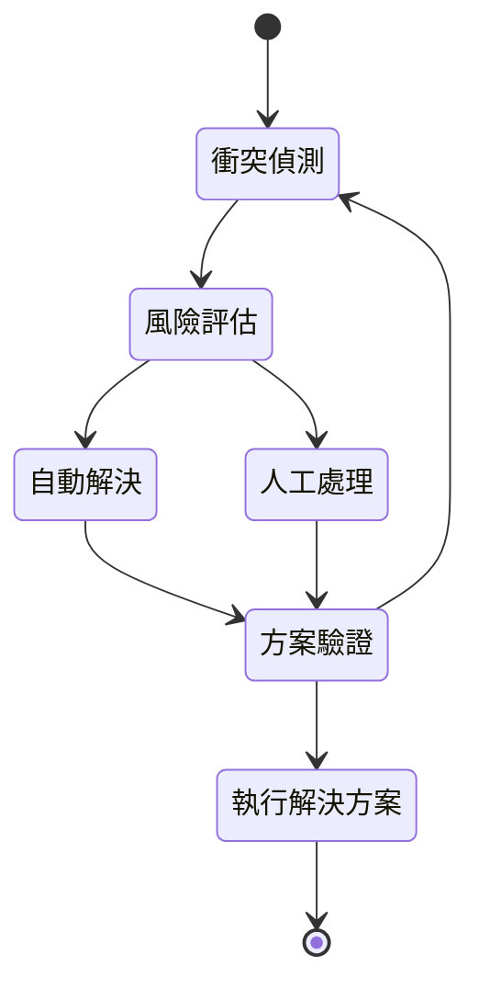

# 衝突處理模組

## 功能概述
衝突處理模組負責偵測和解決排程過程中的各種衝突情況，確保系統運作順暢。

## 核心功能
### 1. 衝突偵測
- 即時衝突檢查
  * 資源重疊檢測
  * 時間衝突偵測
  * 相依性檢查
- 預測性分析
  * 潛在衝突預警
  * 資源瓶頸分析
  * 風險評估

### 2. 衝突解決策略
- 自動解決機制
  * 優先級調整
  * 自動重排程
  * 替代方案生成
- 手動處理流程
  * 人工介入介面
  * 決策支援系統
  * 溝通協調機制

### 3. 衝突預防
- 預防性措施
  * 排程規則優化
  * 資源預留機制
  * 緩衝時間管理
- 學習與改進
  * 歷史數據分析
  * 模式識別
  * 預防策略更新

## 衝突處理流程

## 解決方案優先順序
1. 時間調整
2. 資源重分配
3. 替代資源使用
4. 優先級協調
5. 取消與重排
## 效能考量
1. 即時處理能力
   - 快速響應機制
   - 並行處理策略
   - 優先級處理
2. 系統穩定性
   - 負載均衡
   - 錯誤恢復
   - 資料一致性