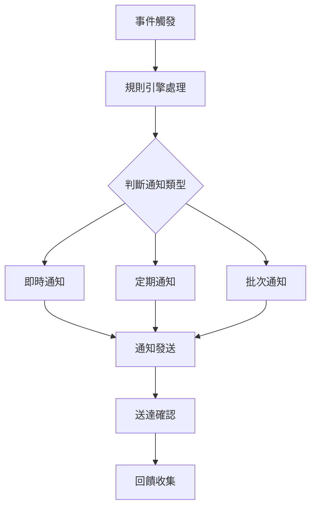

# 通知與回饋系統

## 功能概述
通知與回饋系統負責確保所有相關人員能即時獲得系統狀態、排程變更等重要資訊。

## 核心功能
### 1. 通知管理
- 通知類型
  * 系統通知
  * 排程變更通知
  * 緊急通知
  * 提醒通知
- 通知頻道
  * 電子郵件
  * 系統內部訊息
  * 行動裝置推送
  * 即時通訊整合

### 2. 回饋機制
- 使用者回饋
  * 確認機制
  * 意見收集
  * 滿意度調查
- 系統回饋
  * 執行狀態回報
  * 異常狀況通報
  * 效能報告

### 3. 通知規則引擎
- 觸發條件
  * 事件觸發
  * 時間觸發
  * 狀態變更觸發
- 通知優先級
  * 緊急程度分級
  * 重要性評估
  * 接收者分類

## 通知流程

## 整合介面
1. 外部系統整合
   - 電子郵件系統
   - 簡訊服務
   - 通訊軟體API
   - 推播服務
2. 內部系統整合
   - 使用者管理
   - 權限系統
   - 排程系統
   - 監控系統
## 效能與可靠性
1. 訊息佇列管理
2. 重試機制
3. 備援通知渠道
4. 效能監控