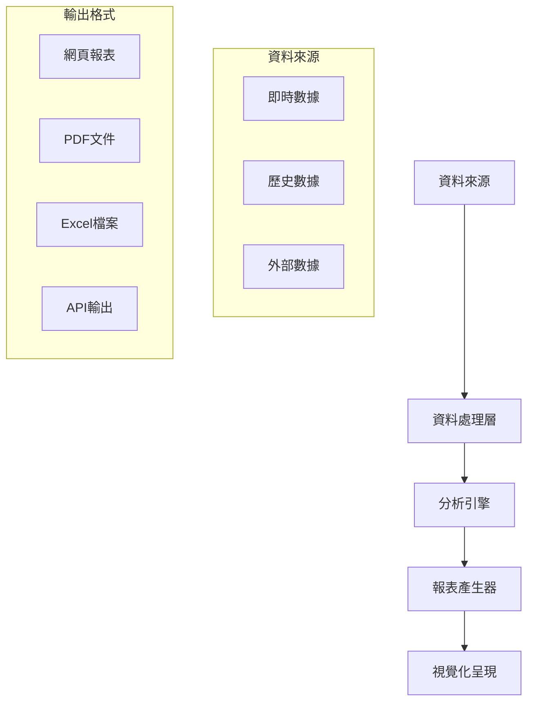

# 報表與分析功能

## 功能概述
報表與分析功能模組提供全方位的數據分析與視覺化呈現，協助管理者做出明智決策。

## 核心功能
### 1. 報表管理
- 標準報表
  * 日常營運報表
  * 效能統計報表
  * 資源使用報表
  * 異常事件報表
- 客製化報表
  * 報表設計器
  * 參數化查詢
  * 自訂格式輸出

### 2. 數據分析
- 基礎分析
  * 描述性統計
  * 趨勢分析
  * 比較分析
- 進階分析
  * 預測分析
  * 相關性分析
  * 效能瓶頸分析
  * 資源利用率分析

### 3. 視覺化呈現
- 圖表類型
  * 即時監控儀表板
  * 統計圖表
  * 甘特圖
  * 資源負載圖
- 互動功能
  * 動態篩選
  * 下鑽分析
  * 資料匯出

## 報表架構

## 分析指標
### 1. 效能指標
- 設備使用率
- 測試完成率
- 資源利用效率
- 排程準確度

### 2. 品質指標
- 異常發生率
- 重工率
- 準時完成率
- 客戶滿意度

### 3. 營運指標
- 成本效益分析
- 資源投資報酬率
- 產能規劃建議
- 效率提升追蹤

## 報表排程
### 1. 自動化報表
- 定期報表產生
  * 每日報表
  * 週報
  * 月報
  * 季報
- 觸發式報表
  * 事件觸發
  * 條件觸發
  * 手動觸發

### 2. 報表分發
- 分發方式
  * 電子郵件
  * 系統通知
  * 檔案共享
- 權限控制
  * 報表存取權限
  * 資料安全控制
  * 隱私保護

## 系統整合
### 1. 資料來源整合
- 內部系統
  * 排程系統
  * 資源管理系統
  * 通知系統
- 外部系統
  * ERP系統
  * MES系統
  * 客戶回饋系統

### 2. 輸出整合
- 檔案格式
  * PDF
  * Excel
  * CSV
  * JSON/XML
- 系統介接
  * API輸出
  * 資料倉儲
  * BI工具

## 效能優化

1. 報表產生效能
   - 資料快取機制
   - 非同步處理
   - 分散式運算

2. 數據處理優化
   - 索引最佳化
   - 查詢效能調校
   - 資料壓縮策略

3. 儲存管理
   - 歷史資料歸檔
   - 資料生命週期管理
   - 儲存空間最佳化